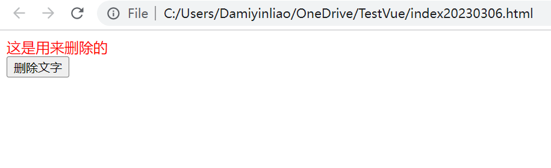

# JS Range使用整理
## 一、Range对象的概念
Range对象代表页面上一段连续的区域，通过Range对象可以获取或者修改页面上任何区域的内容。也可以通过Range的方法进行复制和移动页面任何区域的元素，甚至可以通过Range对象获取并控制光标位置
### 1.获取页面Range对象
```js
var  selection = window.getSelection();   
var  range = selection.getRangeAt(0);//getRangeAt方法获取range，参数为range下标

```
每一个selection对象都有一个或者多个Range对象，每一个range对象代表用户鼠标所选取范围内的一段连续区域，在firefox中，可以通过ctrl键可以选取多个连续的区域，因此在firefox中一个selection对象有多个range对象，在其他浏览器中，用户只能选取一段连续的区域，因此只有一个range对象。
### 2.创建Range对象
```js
var range = document.createRange();
```
## 二、Range对象的属性和方法
### 1.属性
**startContainer**
包含“起点”的节点。“包含”的意思是起点所属的节点。
**endContainer**
包含“结束点”的节点
**startOffset**
“起点”在startContainer中的偏移量。
如果startContainer是文本节点、注释节点或CDATA节点，则返回“起点”在startContainer中字符偏移量。
如果startContainer是元素节点，则返回“起点”在startContainer.childNodes中的次序。
**collapsed**
起点和结束点在一起时为true；Range对象为空（刚createRange()时）也为true。
**commonAncestorContainer**
第一个包含Range的节点，即同时包含Range的起点和结束点。

### 2.定位（设置“起点”和“结束点”）的一些方法

**setStart(node, offset)和setEnd(node, offset)**

setStart：设置起点的位置，node是对startContainer的引用，偏移则是startOffset；
setEnd：设置结束点的位置，node是对endContainer的引用，偏移则是startOffset；
代码如下：

```html
<!DOCTYPE html>
<html lang="en">
<head>
 <meta charset="UTF-8">
 <title>range3</title>
 <script>
  function deleteChar() {
      var div = document.getElementById("myDiv");
      var textNode = div.firstChild;
      var rangeObj = document.createRange();
      rangeObj.setStart(textNode,1);
     rangeObj.setEnd(textNode,4);
     rangeObj.deleteContents();
}
</script>
</head>
<body>
     <div id="myDiv" style="color:red">这段文字是用来删除的</div>
     <button onclick="deleteChar()">删除文字</button>
</body>
</html>
```




**setStartBefore(referenceNode)、setStartAfter(referenceNode)**
**setEndBefore(referenceNode)、setEndAfter(referenceNode)**

setStartBefore：将“起点”设置到referenceNode前
setStartAfter：将“起点”设置到referenceNode后
setEndBefore：将“结束点”设置到referenceNode前
setEndAfter：将“结束点”设置到referenceNode后
注意：使用这四个方法设置的“起点”或“结束点”的父节点与referenceNode的父节点是同一个元素。
代码如下:

```html
<!DOCTYPE html>
<html>
    <head>
        <meta charset="utf-8">
        <title></title>
        <script type="application/javascript">
            function delrow(){
                var table=document.getElementById("mytable");
                if(table.rows.length>0){
                    var row=table.rows[0];
                    var rangeObj=document.createRange();
                    rangeObj.setStartBefore(row);
                    rangeObj.setEndAfter(row);
                    rangeObj.deleteContents();
                }
            }
        </script>
    </head>
    <body>
        <table id="mytable" border="1">
            <tr>
                <td>内容1</td>
                <td>内容2</td>
            </tr>
            <tr>
                <td>内容3</td>
                <td>内容4</td>
            </tr>
        </table>
        <button onclick="delrow()">删除第一行</button>
    </body>
</html>
```

**selectNode(referenceNode)和selectNodeContents(referenceNode)**

selectNode：设置Range的范围，包括referenceNode和它的所有后代(子孙)节点。
selectNodeContents：设置Range的范围，包括它的所有后代节点。

### 3.修改范围的方法

**cloneRange()**
cloneRange()方法将返回一个当前Range的副本，它也是Range对象。
**cloneContents()**
可以克隆选中Range的fragment并返回改fragment。这个方法类似extractContents()，但不是删除，而是克隆
**deleteContents()**
从Dom中删除Range选中的fragment。注意该函数没有返回值（实际上为undefined）。
**extractContents()**
将选中的Range从DOM树中移到一个fragment中，并返回此fragment
**insertNode**
insertNode方法可以插入一个节点到Range中，注意会插入到Range的“起点”
**collapse()**
Range.collapse() 方法向边界点折叠该 Range 。

```js
range.collapse(toStart);//toStart 可选,一个布尔值： true 折叠到 Range 的 start 节点，false 折叠到 end 节点。如果省略，则默认为 false .
```

### 4.比较

**compareBoundaryPoints()**

```js
var compare = comparerange.compareBoundaryPoints(how, sourceRange);
```

compare：返回1, 0, -1.（0为相等，1为时，comparerange在sourceRange之后，-1为comparerange在sourceRange之前）。
how：比较哪些边界点，为常数。
Range.START_TO_START - 比较两个 Range 节点的开始点
Range.END_TO_END - 比较两个 Range 节点的结束点
Range.START_TO_END - 用 sourceRange 的开始点与当前范围的结束点比较
Range.END_TO_START - 用 sourceRange 的结束点与当前范围的开始点比较
sourceRange：个Range对象的边界。

### 5.其它

**detach()**
虽然GC（垃圾收集器）会将其收集，但用detach()释放range对象是一个好习惯。语法为：oRange.detach();

**toString()**
返回该范围表示的文档区域的纯文本内容，不包含任何标签;

### 注意点

除了火狐浏览器外。如果section中已经存在一个range了，再通过addRange添加range是无效
